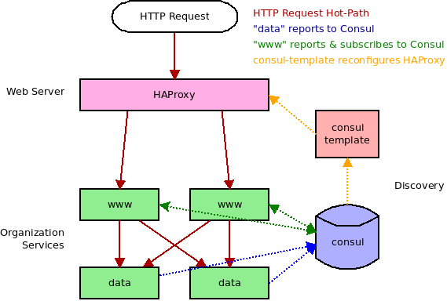

# Consul HAProxy Example

This project will show how to dynamically instantiate Node.js application processes and have Consul reconfigure and restart HAProxy.



## Pre Requisites

Each of these programs consist of a single binary. You can choose to install them completely or simply download and execute the binary. If doing the latter be sure to adjust relative paths.

* [HAProxy](http://www.haproxy.org/)
* [Consul](https://github.com/hashicorp/consul)
* [Consul Template](https://github.com/hashicorp/consul-template)

Also, checkout this repository and run `npm install` to get the required packages.

## HAProxy Stats

At any point you can visit http://localhost:8000/admin?stats to view the inner workings of HAProxy.

## Simple Static Usage

If we simply want to use a known, finite number of HTTP servers we can use a simple HAProxy configuration and launch the number of processes.

```shell
haproxy ./basic.cfg             # Terminal 1
./service-basic-web.js 20001    # Terminal 2
./service-basic-web.js 20002    # Terminal 3
curl http://localhost:8000/     # Terminal 4
```

Unfortunately any time we scale the number of processes we need mo manually modify `basic.cfg`. Luckily we can do better.

## Dynamic Usage

Start a couple data providers, launch an HTTP server, launch HAProxy. Make a few requests and note that they are routed to a single HTTP server. Launch a new server and notice how requests are split between both. Kill an HTTP server and again see how requests are back down to a single server.

```shell
consul agent -dev               # Terminal 1
./service-data.js 30001         # Terminal 2
./service-data.js 30002         # Terminal 3
./service-www.js 20001          # Terminal 4
# Terminal 4
consul-template -template "./advanced.cfg.template:./advanced.cfg:./haproxy-restart.sh"
curl http://localhost:8000      # Terminal 6
curl http://localhost:8000
curl http://localhost:8000
./service-www.js 20002          # Terminal 7
curl http://localhost:8000      # Terminal 6
curl http://localhost:8000
curl http://localhost:8000
# Ctrl + C                      # Terminal 4
curl http://localhost:8000      # Terminal 6
curl http://localhost:8000
curl http://localhost:8000
```
